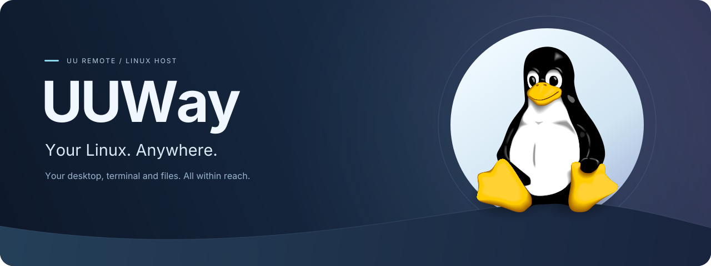
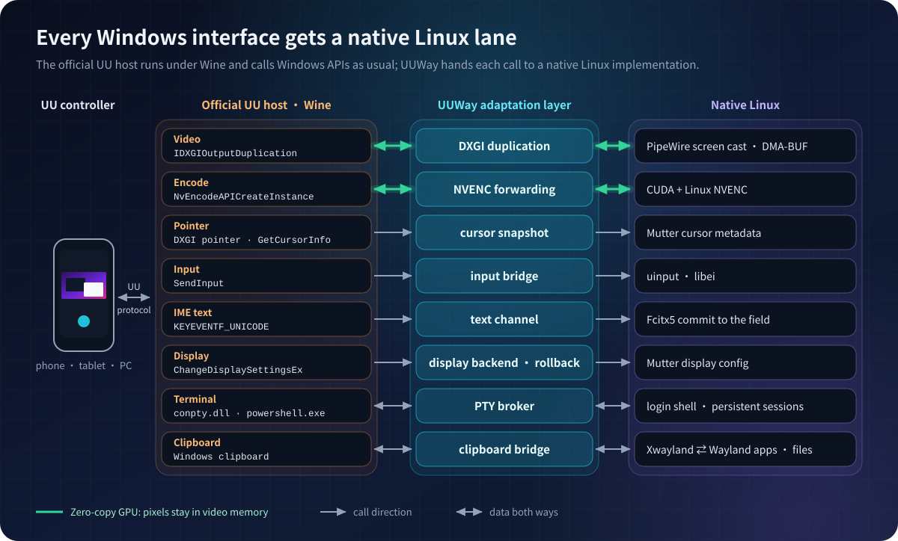
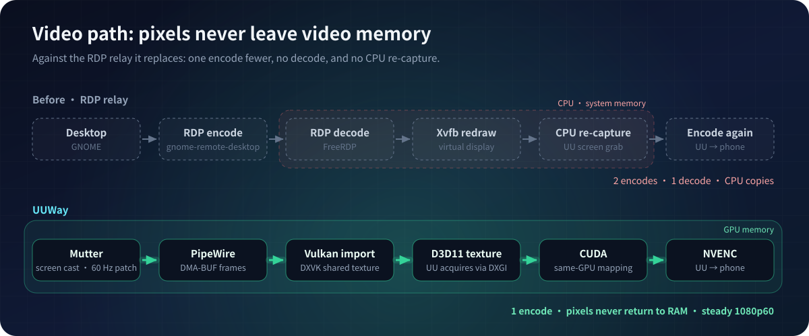

<div align="center">



[简体中文](README.md) · [English](README.en.md)


</div>

**NetEase UU Remote only ships a Windows host — there is no Linux client.** UUWay runs the official
host under Wine, with its files unmodified on disk, and serves every Windows interface it depends on
from a native Linux implementation. Open UU Remote on your phone and drive your Linux desktop just as
you would a Windows PC.

## ✨ Nearly every UU feature works

| UU feature | On Linux | Notes |
| --- | :---: | --- |
| 🎞️ Screen streaming | ✅ | Zero-copy GPU capture + NVENC, up to 60 FPS at 1080p |
| 🖱️ Pointer | ✅ | The controller draws your real cursor theme, and zoomed views follow it |
| ⌨️ Keyboard & mouse | ✅ | Including the Super / ⌘ key, injected through libei / uinput |
| 🀄 Phone IME | ✅ | Chinese text is committed straight into the focused field (Fcitx5) |
| 🖥️ Resolution · refresh rate · scale | ✅ | Applied to Mutter, rolled back if the new mode never reaches the stream |
| 💻 **Remote terminal** | ✅ | Opens your Linux login shell; sessions persist and can run side by side |
| 📋 Clipboard | ✅ | Text in both directions, in real time |
| 📁 Files: phone → desktop | ✅ | Transferred when you paste; the paste waits for the download |
| 📁 Files: other device → Linux desktop | ✅ | The receive directory maps to the Linux XDG downloads directory |
| 📁 Files: desktop → phone | ✅ | Implemented |
| 🪟 Super Screen (virtual displays) | ❌ | Needs a Windows kernel driver (IddCx) that Wine cannot load |
| 🔐 GDM login screen | ❌ | It belongs to another system session; UUWay works inside your desktop session. For remote-only use, enable `uuway autologin on`: a crash or a logout returns to the desktop by itself |
| 📺 1440p / 4K at 60 Hz | ⚠️ | Limited by the refresh rates your display (or dummy plug) advertises |

Verified with UU 4.42.0.2770 and no patch at all ([review](docs/releases/4.42.0.2770-native-review.md)).
UUWay implements public Windows interfaces rather than offsets inside UU, so UU updates rarely matter.

### 💻 Highlight: UU's remote terminal opens a Linux shell

On Windows, UU's remote terminal opens PowerShell. With UUWay it opens **your Linux login shell**.

- Bytes flow **raw** between the PTY and UU with no console layer in between, so full-screen programs
  such as vim and htop render correctly and CJK text stays intact.
- Leave the terminal page and **the session keeps running**; it redraws when you return, and several
  can run at once.
- Closing a terminal in UU ends its shell, exactly as on Windows.

## 🔧 How it works

<p align="center">
  
</p>

UUWay is an **adaptation layer**: UU calls the same APIs it would call on any Windows PC, and each
call lands on a Linux implementation. UU still handles accounts, relays, and codec and bitrate
negotiation.

<p align="center">
  
</p>

See the [design notes](docs/design.md) for details.

## 🚀 Install

**You need:**

- Ubuntu 24.04 with a GNOME 46 **Wayland** session that stays logged in (a display dummy plug for
  headless machines)
- An **NVIDIA** GPU with NVENC and the proprietary driver
- The official UU Remote **Windows** installer and a UU account

**1. Install the package.** Download `uuway_<version>_amd64.deb` from the
[latest release](https://github.com/GaryOAO/UUWay/releases/latest):

```bash
sudo apt install ./uuway_*_amd64.deb
```

**2. Run the setup wizard** as your normal user (no sudo):

```bash
uuway setup --installer ~/Downloads/UURemote_Setup.exe
```

The wizard checks the system, adds and installs WineHQ stable 11.0 (needs sudo), grants input access
(needs an administrator prompt), installs UU into its own Wine prefix, grants screen-cast access,
then writes and starts the user services. Only three things need you: **sign in** in the UU window
it opens, in the screen-sharing dialog **pick the monitor and tick "remember"**, and click **Allow**
in the text-service dialog that follows. Then open UU Remote on your phone — this computer is in your
device list. The wizard's messages are in Chinese.

- The wizard can be run again: finished steps are skipped. `uuway setup --dry-run` only prints what it
  would run, and `--only STEP` redoes a single step.
- When something is wrong, run `uuway doctor`; it checks the environment and the installation item by
  item.
- **Using it only remotely?** Run `uuway autologin on`: after a reboot or a power cut GDM logs your account in by
  itself, and after a desktop crash or a manual logout the login screen logs it in again after about 10 seconds, so UU
  comes back with the desktop (`uuway autologin off` undoes it; turn it off first if you want to stay at the login
  screen). It is a security setting, so the wizard and `--yes` never turn it on for you; anyone who can reach the
  machine gets your desktop at boot, so pair it with disk encryption and an automatic screen lock. UU is offline
  while the GDM login screen is showing, because UUWay's capture and input only exist inside your desktop session;
  this keeps that window to a few seconds.
- The wizard pins WineHQ to the 11.0 series (it writes `/etc/apt/preferences.d/uuway-wine`, after you
  confirm), so that `apt upgrade` cannot move it to a version that breaks screen capture.
- With Fcitx5, the wizard enables the add-on that phone text input needs; run `fcitx5 -r` once for it
  to load.
- Upgrade with `sudo apt install ./newer.deb`, then `uuway refresh` (it restarts the bridge service,
  so a running remote session drops briefly).
- Uninstall with `uuway uninstall`, then `sudo apt remove uuway`. The Wine prefix, which holds your UU
  login, is never deleted.

> In daily use on Ubuntu 24.04 + GNOME 46 Wayland + RTX 3090 + UU 4.42.0.2770. Other GPUs, drivers
> and monitor setups are not verified yet; a
> [compatibility report](https://github.com/GaryOAO/UUWay/issues/new?template=compatibility-report.yml)
> helps, whether it works or not.

**Building from source** (developers):

```bash
git clone https://github.com/GaryOAO/UUWay.git && cd UUWay
./install.sh --installer ~/Downloads/UURemote_Setup.exe
```

The script checks the system, installs the dependencies and WineHQ, builds the native runtime and starts
the services; resume with `./install.sh --from STEP`. For a manual install, the optional 60 FPS pacing
patch and troubleshooting, see the [build and install guide](docs/build.md).

After installation, open **UUWay Console** from the application menu. It uses the bridge's existing
Python + GTK stack and exposes service capabilities, input, text backend, display modes, the Linux
penguin desktop image, and the file receive mapping (XDG Downloads by default).

## 📦 Repository layout

```
install.sh  build-from-source installer
packaging/  deb packaging, container build and install tests
assets/     icons and the desktop image
src/        native backends (Linux and Windows/Wine sides) and helpers
scripts/    service, packaging, build, release-audit tooling and Python/GTK console
patches/    DXVK capture, Mutter pacing, portal session-lifetime patches
config/     pinned build inputs and the udev rule
systemd/    user service templates
tests/      unit tests and probes
docs/       design notes, build guide, release reviews
```

## ⚖️ License

UUWay is licensed under [**GNU AGPL-3.0**](https://github.com/GaryOAO/UUWay/blob/main/LICENSE).

## Disclaimer

UUWay is an independent, unofficial project. It is not affiliated with or endorsed by NetEase.
"UU" and "UU Remote" are trademarks of their respective owners. UUWay distributes no UU program
files; you install the client yourself from the official source.

## Acknowledgements

UUWay grew out of [uu-remote-ubuntu-bridge](https://github.com/lachlanchen/uu-remote-ubuntu-bridge)
by Lachlan Chen, whose RDP-relay design it replaces with a native Wayland pipeline. It also builds
on [DXVK](https://github.com/doitsujin/dxvk), [Wine](https://www.winehq.org/), PipeWire and Mutter.
