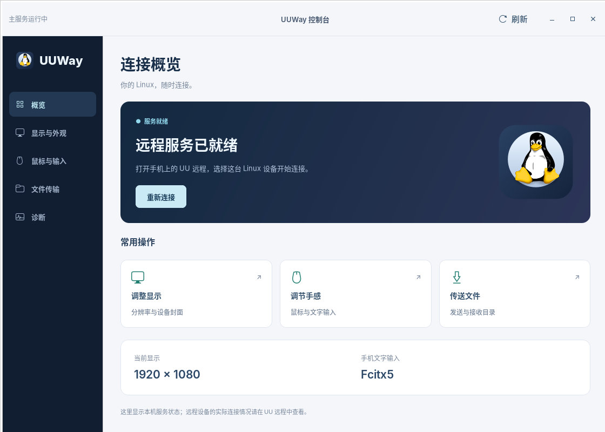

<div align="center">


[简体中文](README.md) · [English](README.en.md)

**[Get started](#get-started)　 / 　[Console](#the-local-console)　 / 　[Features](#what-works)　 / 　[Documentation](#go-further)**

Open source · AGPL-3.0 · Developer preview

</div>

<br>

**Connect to your Linux desktop with NetEase UU Remote.** UUWay runs the official Windows host under Wine and serves its capture, input and system interfaces through native Linux implementations. The UU program files stay unmodified; UU still manages accounts and connections.

| Your desktop, within reach | A terminal that stays open | Files in both directions |
| :--- | :--- | :--- |
| Native Wayland capture and NVENC encoding, up to 60 FPS at 1080p. | Your Linux login shell, with sessions that survive leaving the terminal page. | Shared clipboard and file transfers, received directly into Linux directories. |

## Get started

UUWay is a **developer preview**. The daily development setup is Ubuntu 24.04 with an RTX 3090; the verified requirements are listed below.

| Prepare | Requirement |
| :--- | :--- |
| System and desktop | Ubuntu 24.04, GNOME 46 **Wayland**, with the desktop logged in |
| GPU | An **NVIDIA** GPU with NVENC and the proprietary driver |
| Display | A physical display, or a display dummy plug for a headless host |
| UU Remote | The official **Windows host installer** and a UU account |

```bash
git clone https://github.com/GaryOAO/UUWay.git
cd UUWay
./install.sh --installer ~/Downloads/UURemote_Setup.exe
```

The installer prepares dependencies and Wine, installs UU, builds the native runtime and starts the services. Two steps need you:

1. **Sign in** in the UU window that opens.
2. In the screen-sharing dialog, **select the display and tick “remember.”**

Then open UU Remote on your phone and select this Linux device to connect. Installer messages are in Chinese.

Resume an interrupted install with `./install.sh --from STEP`, or preview the steps with `./install.sh --dry-run`. See the [build and install guide](docs/build.md) for manual setup, the optional 60 FPS pacing patch and troubleshooting.

## The local console

Open **UUWay 控制台** from the application menu. Connection status, everyday settings and diagnostics each have their own place. The console UI is currently in Chinese.



<sub>Interface preview; service status and display values shown are demonstration data.</sub>

| Page | What you can do |
| :--- | :--- |
| **Overview** | Check the local service, start or reconnect, and open common tasks |
| **Display and appearance** | Set resolution, refresh rate and scale; change the device cover shown by UU |
| **Mouse and input** | Adjust pointer and scroll speeds, scroll direction, cursor mode and text input |
| **File transfer** | Select files or folders for the phone; open or change the receive directory |
| **Diagnostics** | Inspect services and directory mappings; generate and copy a status report |

Input speed changes take effect after saving. Settings that need a restart appear in one persistent notice. Display changes made in the console offer a **30-second confirmation window** and revert if you do not confirm.

## What works

| Capability | Support |
| :--- | :--- |
| Screen streaming | Zero-copy GPU capture and NVENC hardware encoding, up to 60 FPS at 1080p |
| Keyboard and mouse | libei / uinput injection, including Super / ⌘; the host cursor theme is supported |
| Phone text input | Fcitx5 commits Chinese and other input directly into the focused field |
| Display modes | Both the console and UU can select modes advertised by Linux, with rollback protection |
| Remote terminal | Linux login shell, persistent concurrent sessions, full-screen apps and CJK text |
| Clipboard | Text synchronization in both directions |
| Files: phone → Linux | Transfer starts on paste; the paste waits for the download |
| Files: other device → Linux | Receive directly into Linux Downloads or a custom directory |
| Files: Linux → phone | Files and directories through the existing file bridge |

**Current limits:** Super Screen virtual displays require a Windows kernel driver and are unsupported. Refresh rates at 1440p / 4K depend on the modes advertised by the display or dummy plug.

Verified with **UU 4.42.0.2770**, without patching the official program. See the [release review](docs/releases/4.42.0.2770-native-review.md). UUWay implements public Windows interfaces instead of relying on fixed offsets inside UU.

<details>
<summary><strong>More on terminals and path mappings</strong></summary>

- Terminal bytes pass directly between the PTY and UU. Sessions keep running when you leave the terminal page, redraw when you return, and end when you close their terminal.
- Wine keeps `C:` as UU's private prefix and maps `Z:` to the Linux root. Desktop, Documents, Downloads and other user folders map to Linux XDG directories.
- UU's receive directory uses the configured Linux download directory; other device drive letters retain the Linux device paths detected by Wine.

</details>

## How it works

UUWay is an adaptation layer. UU calls its usual Windows APIs; Linux implementations handle the display, input, terminal and related interfaces. UU continues to handle accounts, relays, codec and bitrate negotiation.


<details>
<summary><strong>Explore the GPU video path</strong></summary>


See the [design notes](docs/design.md) for the technical details.

</details>

## Go further

| Document | Contents |
| :--- | :--- |
| [Build and installation](docs/build.md) | Requirements, manual deployment, optional patches and troubleshooting |
| [Design notes](docs/design.md) | Native interfaces and data paths |
| [UU release review](docs/releases/4.42.0.2770-native-review.md) | Verified release and compatibility checks |

<details>
<summary><strong>Repository layout</strong></summary>

```text
install.sh  one-step installer
src/        native Linux and Windows/Wine backends and helpers
scripts/    services, builds, packaging, release audits and Python/GTK console
assets/     console icon, desktop cover and vector sources
patches/    DXVK capture, Mutter pacing and Portal lifetime patches
config/     pinned build inputs and udev rules
systemd/    user service templates
native/     native runtime components
tests/      unit tests and probes
docs/       design, installation and release notes
```

</details>

---

**License**　[GNU AGPL-3.0](LICENSE). UUWay is an independent, unofficial project, not affiliated with or endorsed by NetEase. “UU” and “UU Remote” are trademarks of their respective owners. This project distributes no UU program files; obtain the client from its official source.

**Acknowledgements**　UUWay grew out of Lachlan Chen's [uu-remote-ubuntu-bridge](https://github.com/lachlanchen/uu-remote-ubuntu-bridge), replacing its RDP relay with a native Wayland pipeline. It also builds on [DXVK](https://github.com/doitsujin/dxvk), [Wine](https://www.winehq.org/), PipeWire and Mutter.
