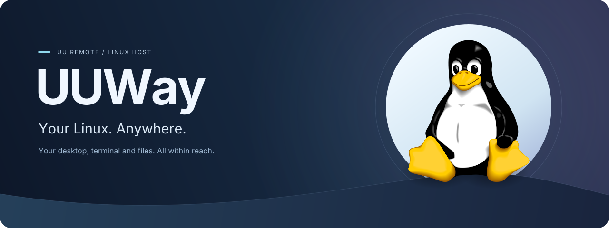
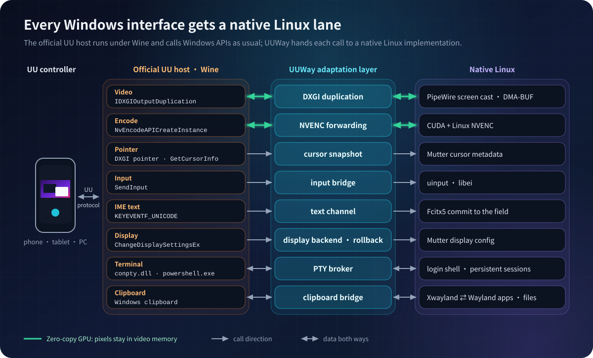
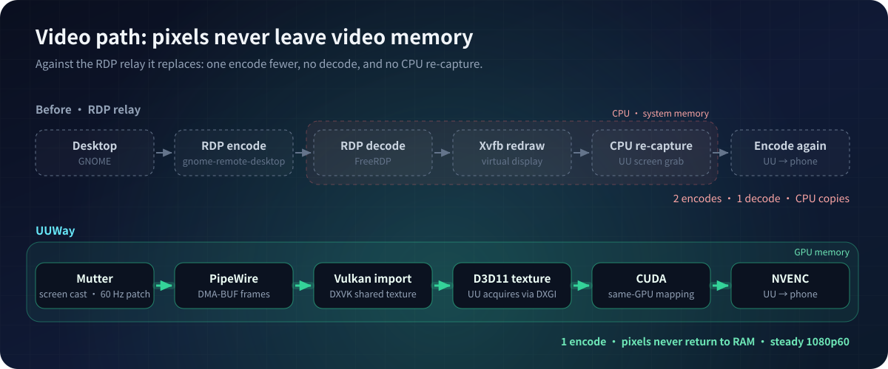

<div align="center">



[简体中文](README.md) · [English](README.en.md)


</div>

UUWay runs the official Windows UU Remote host on Linux so you can control your desktop from a phone or another device. UU's files stay unmodified; native Linux components provide capture, input and display management.

## UU feature support

The following common UU features are adapted for Linux. See [supported scope](#supported-scope) for limitations.

| UU feature | Linux support |
| --- | --- |
| Video streaming | H.264 / HEVC through NVIDIA NVENC or AMD VA-API |
| Mouse pointer | Native cursor theme, position and shape |
| Keyboard and mouse | Remote input, including Win / ⌘ keys |
| Phone input method | Commit Chinese and other text to the focused field through Fcitx5 |
| Multiple displays | Independent capture and display selection from the controller |
| Resolution, refresh rate and scale | Select modes exposed by Linux, with automatic rollback on failure |
| Super Screen | Virtual displays and exclusive mode; restore original displays on exit or failure |
| Remote terminal | Linux login shells, multiple sessions that keep running when you leave the page |
| Clipboard | Bidirectional text sync |
| File transfer | Phone ↔ Linux; files from other devices arrive in the mapped Linux receive directory |

**UUWay Console** also manages services, input, displays, file directories and software updates. It supports manual and automatic update checks; installation requires confirmation.

## Install

Mainline targets **GNOME Wayland**, with an NVIDIA GPU supporting NVENC or an AMD GPU supporting H.264/HEVC VA-API. Ubuntu 24.04 / GNOME 46 is the reference environment; Ubuntu 26.04 also has compatibility fixes and hardware validation. Keep the desktop logged in. A machine without a monitor still needs a desktop output, such as a display dummy plug.

1. Download the `.deb` from [Releases](https://github.com/GaryOAO/UUWay/releases/latest) and obtain the official Windows UU installer.
2. Install the package and run setup as your normal user:

   ```bash
   sudo apt install ./uuway_*_amd64.deb
   uuway setup --installer ~/Downloads/UURemote_Setup.exe
   ```

3. Sign in to UU and allow screen sharing and the text service when prompted. Open **UUWay Console** from the application menu, then connect from your controller.

Release packages are built on Ubuntu 24.04; [build from source](docs/build.md) if another version has different dependencies. Setup installs and pins Wine 11, verifies the encoder and configures user services. It can be run again. NVIDIA is tried first, then AMD; GPU drivers are not installed or switched. After first enabling the Fcitx5 add-on, restart the input method with `fcitx5 -r`. The console and wizard currently use Chinese.

## Common commands

```bash
uuway doctor                   # Check environment and services
uuway update                   # Check for updates
uuway update install           # Install an update
uuway update status            # View the result
uuway update rollback          # Roll back an update
uuway refresh --restart-display # Reload display service; removes Super Screens
```

The console checks for updates every six hours while open; automatic checks can be disabled. Updating briefly disconnects remote sessions. OTA installation requires a `.deb` install; source installations should rebuild from updated source.

For remote-only use, `uuway autologin on` enables GDM login and relogin after the desktop exits. Anyone with physical access can also enter the desktop; consider that before enabling it. Disable with `uuway autologin off`.

To uninstall, run `uuway uninstall`, then `sudo apt remove uuway`. The Wine prefix and UU login are retained.

## Supported scope

| Environment | Validation |
| --- | --- |
| Ubuntu 24.04 · GNOME 46 Wayland · RTX 3090 | Maintainer's daily use and regression checks |
| Ubuntu 26.04 · GNOME Wayland · Radeon 780M | [Community hardware validation](https://github.com/GaryOAO/UUWay/pull/4); Python 3.14 text-service support and the [OSC 3008 terminal fix](https://github.com/GaryOAO/UUWay/issues/2) are included |
| Debian 13 (trixie) · GNOME 48.7 · RTX 3090 | [Reported working after local adjustments](https://github.com/GaryOAO/UUWay/issues/15): UUWay 1.2.0, Wine 11.0, NVIDIA 550.163.01, 1080p 75 Hz; a UU startup hang was resolved through local source changes, but the changes were not provided |
| Manjaro · KDE Plasma / KWin Wayland | [Reported working](https://github.com/GaryOAO/UUWay/issues/14) through a community KDE branch; mainline setup targets GNOME |

Reports from other setups are welcome through the [compatibility template](https://github.com/GaryOAO/UUWay/issues/new?template=compatibility-report.yml).

- Up to eight active displays. Mirroring, rotation and Intel-only encoding are unsupported. AMD uses host-memory copies; NVIDIA uses a zero-copy GPU path.
- Super Screen can still show two cursors. Display modes, drivers and hardware limit resolution, refresh rate and streaming performance; a 144 Hz mode does not guarantee a 144 fps stream.
- Works inside a logged-in desktop session, not at the GDM login screen. Layout changes are temporary; save permanent layouts in GNOME Settings.

## How it works

UU handles accounts, connections and bitrate negotiation. The zero-copy GPU diagram describes NVIDIA; AMD uses host-memory copies.





## Develop

```bash
git clone https://github.com/GaryOAO/UUWay.git
cd UUWay
./install.sh --installer ~/Downloads/UURemote_Setup.exe
```

[Build and troubleshooting](docs/build.md) · [Design](docs/design.md) · [Super Screen and recovery](docs/super-screen-lifecycle.md) · [AMD backend](docs/amd-vaapi.md)

## License and credits

[GNU AGPL-3.0](LICENSE). UUWay is an independent, unofficial project, unaffiliated with NetEase. It does not distribute UU program files.

Derived from [uu-remote-ubuntu-bridge](https://github.com/lachlanchen/uu-remote-ubuntu-bridge), and built on [Wine](https://www.winehq.org/), [DXVK](https://github.com/doitsujin/dxvk), PipeWire and Mutter.
