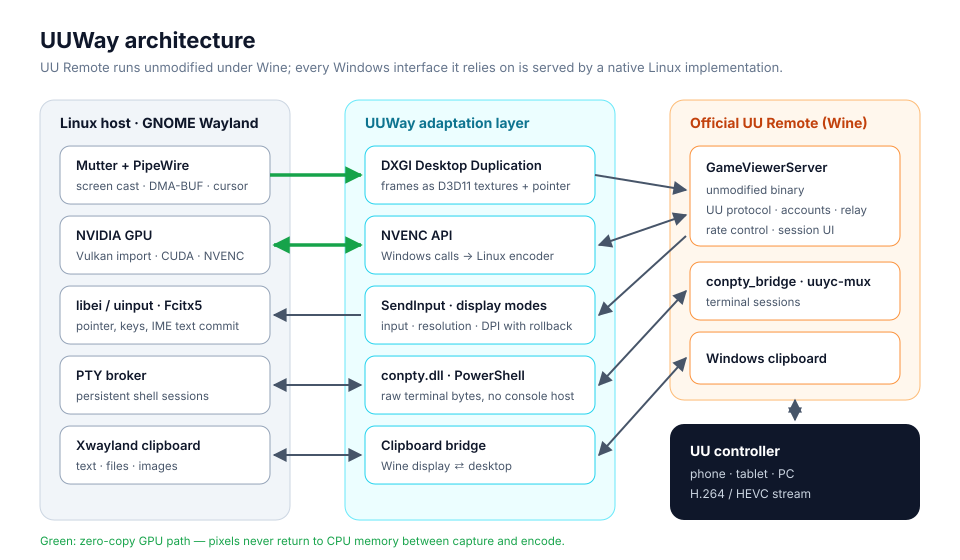
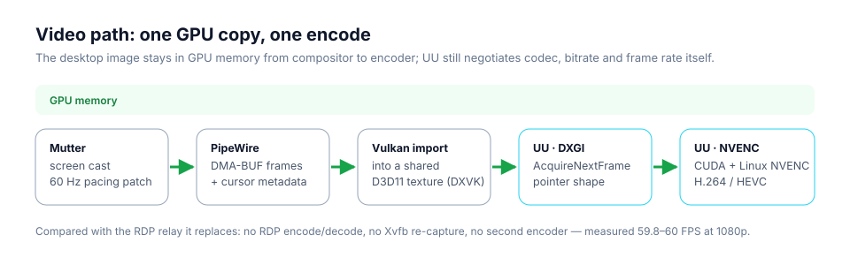

<div align="center">

# UUWay

**Run NetEase UU Remote as a first-class host on Linux — Wayland-native, GPU-accelerated, no RDP in between.**

[English](README.md) · [简体中文](README.zh-CN.md)


</div>

UU Remote only ships a Windows host. UUWay runs the **official, unmodified** Windows host under
Wine and serves every Windows interface it depends on — desktop capture, hardware encoding, input,
display modes, the pointer, its remote terminal and the clipboard — from native Linux
implementations. UU keeps doing what it is good at (accounts, relays, codec and bitrate
negotiation); Linux does the rest, directly on the GPU.

<p align="center">
  
</p>

## Highlights

| | |
| --- | --- |
| 🎞️ **Zero-copy video** | Wayland screen cast → DMA-BUF → Vulkan → D3D11 texture → CUDA → NVENC. Pixels never return to system memory; 1080p runs at a steady 60 FPS. |
| 🖱️ **Native pointer** | The pointer travels as DXGI pointer data, exactly as on Windows, so the controller draws your real cursor theme — arrow, I-beam, hand, resize — and zoomed views follow it. |
| ⌨️ **Input & IME** | Mouse, wheel and keyboard (including the Super / ⌘ key) through libei/uinput; phone IME text is committed through Fcitx5 into the focused field, CJK included. |
| 🖥️ **Display control** | Resolution, refresh rate and DPI changes from the controller map to Mutter, with automatic rollback if the new mode never reaches the stream. |
| 💻 **Remote terminal** | UU's terminal opens your Linux login shell. Bytes flow raw between the PTY and UU; sessions persist when you leave, several can run at once, and closing one in UU ends its shell. |
| 📋 **Clipboard** | Text, files and images in both directions between the controller and desktop apps. |
| 🧩 **Upgrade-tolerant** | UUWay implements public Windows interfaces, not offsets inside UU. UU 4.39 → 4.42 needed a single script tweak and no binary patch. |
| 🛠️ **Control console** | A small GTK app shows service state, applies input speed settings and restarts UU. |

## How it works

UUWay is an **adaptation layer**: UU calls the Windows API it would call on any PC, and each call
lands on a Linux implementation.

| UU calls (Windows) | UUWay serves it with (Linux) |
| --- | --- |
| `IDXGIOutputDuplication` frames | PipeWire screen cast imported into a D3D11 texture via Vulkan/DXVK |
| DXGI pointer position and `GetFramePointerShape` | Screen-cast cursor metadata (the video carries no pointer) |
| `NvEncodeAPICreateInstance` / NVENC function table | Linux CUDA + NVENC on the same GPU |
| `SendInput` | libei / uinput on the Wayland session |
| `KEYEVENTF_UNICODE` text | Fcitx5 add-on commits text into the focused field |
| `ChangeDisplaySettingsEx`, DPI queries | Mutter monitor configuration with a rollback guardian |
| `conpty.dll` + `powershell.exe` for the terminal | A PTY broker with persistent named sessions |
| Windows clipboard | Wine ⇄ Xwayland clipboard bridge; Mutter mirrors it to Wayland apps |

<p align="center">
  
</p>

More detail: [design notes](docs/design.md).

## Requirements

- Ubuntu 24.04 with GNOME 46 on **Wayland**, a logged-in desktop session (a display dummy plug
  works well for headless machines)
- An **NVIDIA** GPU with NVENC and the proprietary driver (developed on an RTX 3090, driver 580)
- WineHQ stable 11 in `/opt/wine-stable`
- The official UU Remote Windows installer and a UU account
- Build tools: gcc, mingw-w64, winegcc, meson/ninja (DXVK, Mutter), Rust (console)

## Getting started

UUWay is a **developer preview**: it runs daily on the machine it was built on, but installation
is a from-source procedure, not a one-click installer.

```bash
git clone https://github.com/GaryOAO/UUWay.git && cd UUWay
```

Then follow the [build and install guide](docs/build.md). In short:

1. Install UU into its own Wine prefix and sign in once.
2. Build the native runtime (DXVK capture, DXGI/NVENC/display/input backends, helpers).
3. Grant screen-cast permission once and save the restore token.
4. Package a runtime bundle and install the user services.
5. Connect from your phone.

## Status

| Area | State |
| --- | --- |
| Video, input, IME, pointer, resolution changes | ✅ in daily use |
| Remote terminal (persistent sessions) | ✅ in daily use |
| Clipboard: text | ✅ both directions |
| Clipboard: files and images | 🧪 implemented, awaiting controller acceptance |
| UU 4.42.0.2770 | ✅ runs unpatched ([review](docs/releases/4.42.0.2770-native-review.md)) |
| Super Screen (virtual displays) | ❌ relies on a Windows IddCx kernel driver that Wine cannot load |
| 1440p/4K at 60 Hz | ⚠️ limited by the refresh rates your display (or dummy plug) advertises |

## Repository layout

```
src/        native backends (Linux + Windows/Wine side) and helpers
scripts/    service, packaging, build and review tooling
patches/    DXVK capture, Mutter capture pacing, portal session lifetime
config/     pinned build dependencies and udev rule
systemd/    user service templates
native/     control console (Rust + GTK)
tests/      unit tests and probes
docs/       design notes, build guide, release reviews
```

## Disclaimer

UUWay is an independent, unofficial project and is not affiliated with or endorsed by NetEase.
"UU" and "UU Remote" are trademarks of their owners. UUWay does not redistribute any UU binaries;
you install the official client yourself.

## Acknowledgements

UUWay grew out of [uu-remote-ubuntu-bridge](https://github.com/lachlanchen/uu-remote-ubuntu-bridge)
by Lachlan Chen (MIT), whose RDP-relay design it replaces with a native Wayland pipeline. It also
builds on [DXVK](https://github.com/doitsujin/dxvk), [Wine](https://www.winehq.org/),
PipeWire and Mutter.

## License

[MIT](LICENSE)
