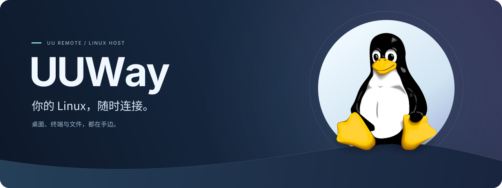
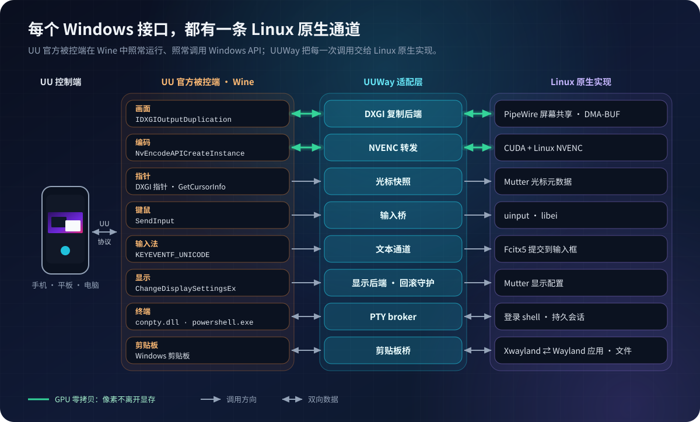
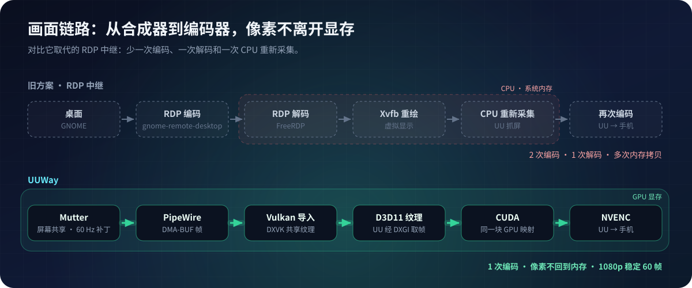

<div align="center">



[简体中文](README.md) · [English](README.en.md)


</div>

**网易 UU 远程官方只有 Windows 被控端，没有 Linux 版客户端。** UUWay 让官方原版被控端在 Wine 中运行（磁盘上的文件不做任何修改），再把它依赖的每一个 Windows 接口交给 Linux 原生实现。于是，用手机打开 UU 远程，就能像控制一台 Windows 电脑一样控制你的 Linux 桌面。

## ✨ UU 的功能，几乎全部可用

| UU 功能 | Linux 上 | 说明 |
| --- | :---: | --- |
| 🎞️ 画面串流 | ✅ | GPU 零拷贝 + NVENC 硬件编码，1080p 可达 60 帧 |
| 🖱️ 鼠标指针 | ✅ | 手机上显示你本机真实的光标主题，放大画面也跟随指针 |
| ⌨️ 键盘与鼠标 | ✅ | 包括 Win / ⌘ 键，经 libei / uinput 注入 |
| 🀄 手机输入法 | ✅ | 中文直接提交到当前输入框（Fcitx5） |
| 🖥️ 分辨率 · 刷新率 · 缩放 | ✅ | UUWay 和 UU 客户端都可选择 Linux 已公布的模式；切换期间保留事务保护，失败会自动回滚 |
| 💻 **远程终端** | ✅ | 打开的是 Linux 登录 shell，会话常驻、可以多开 |
| 📋 剪贴板 | ✅ | 文本双向实时同步 |
| 📁 文件：手机 → 电脑 | ✅ | 粘贴时才传输，下载完成前粘贴会等待 |
| 📁 文件：其他设备 → Linux 电脑 | ✅ | 接收目录映射到 Linux 的 XDG 下载目录 |
| 📁 文件：电脑 → 手机 | ✅ | 已实现 |
| 🪟 超级屏（虚拟显示器） | ❌ | 依赖 Windows 内核驱动（IddCx），Wine 无法加载 |
| 🔐 GDM 登录界面 | ❌ | 登录界面属于另一个系统会话，UUWay 只在你的桌面会话里工作；远程使用请开启 `uuway autologin on` |
| 📺 1440p / 4K 60 Hz | ⚠️ | 受显示器（或诱骗器）提供的刷新率限制 |

安装完成后，从应用菜单打开 **UUWay 控制台**。它使用项目已有的 Python + GTK 桥接栈，集中显示服务能力，并可配置输入、文字后端、显示模式、桌面企鹅图片和文件接收目录映射（默认使用 XDG 下载目录）。

Wine 路径会在部署阶段统一对接 Linux：`C:` 保留为 UU 的独立 Wine 前缀，`Z:` 对应 Linux 根目录，桌面、文档、下载、音乐、图片、视频、公共目录和模板目录对应当前用户的 XDG 目录；UU 的接收目录与 Linux 下载目录使用同一映射。光盘和其他设备盘符继续保留 Wine 检测到的 Linux 设备路径。

已验证 UU 4.42.0.2770，无需任何补丁（[审计记录](docs/releases/4.42.0.2770-native-review.md)）。UUWay 实现的是公开的 Windows 接口，而不是 UU 内部的偏移地址，所以 UU 升级基本不受影响。

### 💻 亮点：UU 远程终端，直达 Linux shell

UU 的「远程终端」在 Windows 上打开的是 PowerShell；在 UUWay 上，它打开的是**你的 Linux 登录 shell**。

- 终端字节在 PTY 与 UU 之间**原样转发**，没有控制台转换层，vim、htop 这类全屏程序显示正常，中文不乱码；
- 离开终端页面，**会话继续运行**，回来时自动重绘，还可以同时开多个；
- 在 UU 里关闭终端，就结束对应的 shell，行为和 Windows 上完全一致。

## 🔧 工作原理

<p align="center">
  
</p>

UUWay 是一层**适配层**：UU 照常调用它在任何一台 Windows 电脑上都会调用的 API，每一次调用都落到对应的 Linux 实现上。账号、中继、编码与码率协商仍由 UU 自己负责。

<p align="center">
  
</p>

更多细节见[设计说明](docs/design.md)（英文）。

## 🚀 安装

**准备：**

- Ubuntu 24.04，GNOME 46 **Wayland** 会话，桌面保持登录（没有显示器的主机插一个显示器诱骗器）
- 支持 NVENC 的 **NVIDIA** 显卡和官方驱动
- UU 远程官方 **Windows 版**安装包，以及一个 UU 账号

**1. 安装软件包。** 从 [Releases](https://github.com/GaryOAO/UUWay/releases/latest) 下载 `uuway_<版本>_amd64.deb`：

```bash
sudo apt install ./uuway_*_amd64.deb
```

**2. 运行安装向导**（用普通用户，不要加 sudo）：

```bash
uuway setup --installer ~/Downloads/UURemote_Setup.exe
```

向导会依次检查环境、添加并安装 WineHQ stable 11.0（需要 sudo）、授权键鼠注入（需要管理员授权）、把 UU 装进独立的 Wine 前缀、授权屏幕共享，最后写入并启动用户服务。整个过程只有三件事需要你亲手完成：在弹出的 UU 窗口里**登录账号**，在屏幕共享对话框里**选择显示器并勾选「记住」**，以及在随后弹出的文字服务对话框里点**允许**。完成后打开手机上的 UU 远程，设备列表里就会出现这台电脑。

- 向导可以反复运行：已完成的步骤会跳过。`uuway setup --dry-run` 只显示将要执行的命令，`--only 步骤` 只重做某一步。
- 出问题先运行 `uuway doctor`，它会逐项检查环境和安装状态。
- **只用远程、不常在机器前？** 运行 `uuway autologin on`：重启或断电恢复后 GDM 自动登录你的账号，UU 随桌面自动上线（关闭：`uuway autologin off`）。这是安全相关的开关，向导和 `--yes` 都不会替你开启；代价是任何能接触这台机器的人开机就能进入你的桌面，建议配合磁盘加密和自动锁屏。UU 在登录界面（GDM）和手动注销后是离线的，因为 UUWay 的采集和输入都只在你的桌面会话里。
- 向导会把 WineHQ 固定在 11.0 系列（写入 `/etc/apt/preferences.d/uuway-wine`，需要你确认），避免 `apt upgrade` 悄悄升到会让画面采集失效的版本。
- 如果你使用 Fcitx5，向导会启用手机中文输入所需的插件，需要执行一次 `fcitx5 -r` 才会生效。
- 升级：`sudo apt install ./新版本.deb`，再运行 `uuway refresh`（会重启桥接服务，正在进行的远程会话会短暂断开）。
- 卸载：先 `uuway uninstall`，再 `sudo apt remove uuway`。Wine 前缀（含 UU 登录信息）不会被删除。

> 已在 Ubuntu 24.04 + GNOME 46 Wayland + RTX 3090 + UU 4.42.0.2770 上长期日常使用。其他显卡、驱动和显示器配置还缺少验证，欢迎提交[兼容性报告](https://github.com/GaryOAO/UUWay/issues/new?template=compatibility-report.yml)，成功和失败的都有帮助。

**从源码构建**（开发者）：

```bash
git clone https://github.com/GaryOAO/UUWay.git && cd UUWay
./install.sh --installer ~/Downloads/UURemote_Setup.exe
```

脚本会检查环境、安装依赖和 WineHQ、构建原生运行时并启动服务；中断后用 `./install.sh --from 步骤号` 继续。手动安装、可选的 60 帧帧节奏补丁和排错见[构建与安装指南](docs/build.md)（英文）。

## 📦 目录结构

```
install.sh  从源码构建并安装的脚本
packaging/  deb 打包、容器内构建与安装测试
assets/     图标与桌面图片
src/        原生后端（Linux 侧与 Windows/Wine 侧）及辅助程序
scripts/    服务、打包、构建、版本审计工具及 Python/GTK 控制台
patches/    DXVK 采集、Mutter 帧节奏、Portal 会话生命周期补丁
config/     固定版本的构建依赖与 udev 规则
systemd/    用户服务模板
tests/      单元测试与探针
docs/       设计说明、构建指南、版本审计
```

## ⚖️ 许可证

UUWay 采用 [**GNU AGPL-3.0**](https://github.com/GaryOAO/UUWay/blob/main/LICENSE)。

## 免责声明

UUWay 是独立的非官方项目，与网易无关，也未获得网易的认可。"UU"、"UU 远程"为其各自所有者的商标。UUWay 不分发任何 UU 程序文件，客户端需由你自行从官方渠道安装。

## 致谢

UUWay 源于 Lachlan Chen 的 [uu-remote-ubuntu-bridge](https://github.com/lachlanchen/uu-remote-ubuntu-bridge)，并以原生 Wayland 链路取代了其中的 RDP 中继设计。项目同样建立在 [DXVK](https://github.com/doitsujin/dxvk)、[Wine](https://www.winehq.org/)、PipeWire 与 Mutter 之上。
